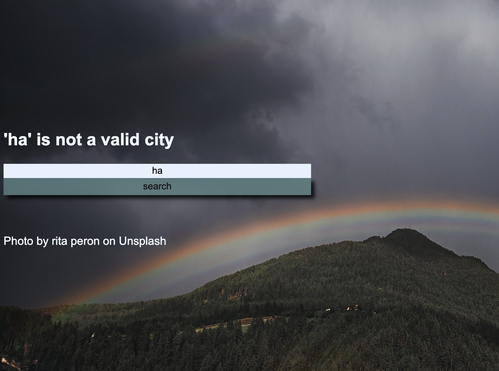

# weather_app

## Description
A wether app, where the user inputs a city name and the next 5 days weather conditions are forecasted onto little cards situated in the middle of the screen.

The app uses the input and appends it to the API url to extrapolate all relevant data (such as temperature, date, wind speed ect..) to populate the cards.

deployed website URL: https://tomal1.github.io/6_weather_app/

gitHub repo URL: https://github.com/Tomal1/6_weather_app

## Usage

When the user types in a city name and press's the search button, 5 cards will be displayed in the middle of the screen with weather condition for the next 5 days. 

If the user dose not input any text into search field but still press's the search button; an alert will be displayed requesting the user that the input cannot be left empty.

If the user inputs a city that the API dose not recognise (404 bad request); a message just above the input field will let the user know that the input was not a valid city name.

## License
Please refer to the LICENSE in the repo.
